# Agent Systems Benchmark status

> Generated deterministically from task front matter. Do not edit this file directly.
> Status records coordination progress; it is not evidence that product behavior is accepted.

## Portfolio overview

**49 ARs tracked** across 3 active status categories.

| Status | Meaning | Count |
| --- | --- | ---: |
| **In progress** | Claimed work with a live lease | 4 |
| **Open** | Dependency-ready and available to claim | 0 |
| **Blocked** | Cannot proceed until its recorded blocker clears | 0 |
| **Planned** | Defined work awaiting promotion or dependencies | 30 |
| **Future** | Deferred roadmap work | 0 |
| **Done** | Accepted, integrated, and durably verified | 15 |
| **Cancelled** | Stopped with a recorded rationale | 0 |
| **Superseded** | Replaced by another AR | 0 |

## Dependency graph

Arrows point from each prerequisite to the work that depends on it. Color is redundant
with the status text inside every node; the tables below are the complete text
alternative.

```mermaid
flowchart LR
    subgraph series_00["00 - Coordination foundation"]
        direction TB
        AR_0001["AR-0001 - Done"]:::status_done
        AR_0002["AR-0002 - Done"]:::status_done
        AR_0003["AR-0003 - Done"]:::status_done
        AR_0004["AR-0004 - Done"]:::status_done
    end
    subgraph series_01["01 - Contracts and runtime"]
        direction TB
        AR_0101["AR-0101 - Done"]:::status_done
        AR_0102["AR-0102 - Done"]:::status_done
        AR_0103["AR-0103 - Done"]:::status_done
        AR_0104["AR-0104 - Done"]:::status_done
    end
    subgraph series_02["02 - Analysis"]
        direction TB
        AR_0201["AR-0201 - Done"]:::status_done
        AR_0202["AR-0202 - Planned"]:::status_planned
        AR_0203["AR-0203 - Done"]:::status_done
        AR_0204["AR-0204 - In progress"]:::status_in_progress
    end
    subgraph series_03["03 - Adapters and workloads"]
        direction TB
        AR_0301["AR-0301 - In progress"]:::status_in_progress
        AR_0302["AR-0302 - Planned"]:::status_planned
        AR_0303["AR-0303 - Planned"]:::status_planned
        AR_0304["AR-0304 - Planned"]:::status_planned
        AR_0305["AR-0305 - Planned"]:::status_planned
        AR_0306["AR-0306 - Planned"]:::status_planned
        AR_0307["AR-0307 - Planned"]:::status_planned
        AR_0308["AR-0308 - Planned"]:::status_planned
        AR_0309["AR-0309 - Planned"]:::status_planned
    end
    subgraph series_04["04 - Live measurement"]
        direction TB
        AR_0401["AR-0401 - Planned"]:::status_planned
        AR_0402["AR-0402 - Planned"]:::status_planned
        AR_0403["AR-0403 - Planned"]:::status_planned
        AR_0404["AR-0404 - Planned"]:::status_planned
        AR_0405["AR-0405 - Planned"]:::status_planned
        AR_0406["AR-0406 - Planned"]:::status_planned
    end
    subgraph series_05["05 - Replay"]
        direction TB
        AR_0501["AR-0501 - Done"]:::status_done
        AR_0502["AR-0502 - Done"]:::status_done
        AR_0503["AR-0503 - Done"]:::status_done
        AR_0504["AR-0504 - In progress"]:::status_in_progress
        AR_0505["AR-0505 - Planned"]:::status_planned
    end
    subgraph series_06["06 - Metrics"]
        direction TB
        AR_0601["AR-0601 - Planned"]:::status_planned
    end
    subgraph series_07["07 - Platforms"]
        direction TB
        AR_0701["AR-0701 - Done"]:::status_done
        AR_0702["AR-0702 - Planned"]:::status_planned
    end
    subgraph series_08["08 - Interfaces"]
        direction TB
        AR_0801["AR-0801 - Planned"]:::status_planned
        AR_0802["AR-0802 - Planned"]:::status_planned
    end
    subgraph series_09["09 - Assurance"]
        direction TB
        AR_0901["AR-0901 - Done"]:::status_done
        AR_0902["AR-0902 - Planned"]:::status_planned
        AR_0903["AR-0903 - Planned"]:::status_planned
        AR_0904["AR-0904 - Planned"]:::status_planned
        AR_0905["AR-0905 - Planned"]:::status_planned
    end
    subgraph series_10["10 - Reliability and release"]
        direction TB
        AR_1001["AR-1001 - In progress"]:::status_in_progress
        AR_1002["AR-1002 - Planned"]:::status_planned
        AR_1003["AR-1003 - Planned"]:::status_planned
        AR_1004["AR-1004 - Planned"]:::status_planned
        AR_1005["AR-1005 - Planned"]:::status_planned
        AR_1006["AR-1006 - Planned"]:::status_planned
        AR_1007["AR-1007 - Planned"]:::status_planned
    end
    AR_0001 --> AR_0002
    AR_0001 --> AR_0003
    AR_0001 --> AR_0101
    AR_0001 --> AR_0501
    AR_0001 --> AR_0701
    AR_0002 --> AR_0004
    AR_0002 --> AR_0903
    AR_0003 --> AR_0903
    AR_0101 --> AR_0102
    AR_0101 --> AR_0104
    AR_0101 --> AR_0201
    AR_0101 --> AR_0203
    AR_0101 --> AR_0301
    AR_0101 --> AR_0302
    AR_0101 --> AR_0303
    AR_0101 --> AR_0304
    AR_0101 --> AR_0305
    AR_0101 --> AR_0306
    AR_0101 --> AR_0307
    AR_0101 --> AR_0308
    AR_0101 --> AR_0309
    AR_0101 --> AR_0401
    AR_0101 --> AR_0502
    AR_0101 --> AR_0601
    AR_0101 --> AR_0801
    AR_0101 --> AR_0901
    AR_0101 --> AR_0904
    AR_0101 --> AR_1001
    AR_0101 --> AR_1003
    AR_0101 --> AR_1005
    AR_0102 --> AR_0103
    AR_0102 --> AR_0201
    AR_0102 --> AR_0204
    AR_0102 --> AR_0301
    AR_0102 --> AR_0302
    AR_0102 --> AR_0303
    AR_0102 --> AR_0304
    AR_0102 --> AR_0305
    AR_0102 --> AR_0306
    AR_0102 --> AR_0307
    AR_0102 --> AR_0308
    AR_0102 --> AR_0309
    AR_0102 --> AR_0503
    AR_0102 --> AR_0601
    AR_0102 --> AR_0901
    AR_0102 --> AR_0905
    AR_0103 --> AR_0202
    AR_0103 --> AR_0204
    AR_0103 --> AR_0305
    AR_0103 --> AR_0306
    AR_0103 --> AR_0307
    AR_0103 --> AR_0308
    AR_0103 --> AR_0309
    AR_0103 --> AR_0401
    AR_0103 --> AR_0702
    AR_0103 --> AR_0902
    AR_0103 --> AR_1002
    AR_0104 --> AR_0204
    AR_0104 --> AR_0601
    AR_0104 --> AR_0801
    AR_0104 --> AR_0902
    AR_0104 --> AR_0905
    AR_0104 --> AR_1002
    AR_0104 --> AR_1005
    AR_0201 --> AR_0202
    AR_0201 --> AR_0204
    AR_0201 --> AR_0504
    AR_0201 --> AR_0601
    AR_0201 --> AR_0702
    AR_0203 --> AR_0204
    AR_0203 --> AR_0901
    AR_0203 --> AR_1001
    AR_0203 --> AR_1004
    AR_0204 --> AR_0801
    AR_0204 --> AR_0903
    AR_0204 --> AR_0905
    AR_0204 --> AR_1004
    AR_0204 --> AR_1006
    AR_0301 --> AR_0505
    AR_0301 --> AR_1003
    AR_0302 --> AR_0505
    AR_0302 --> AR_1003
    AR_0303 --> AR_0505
    AR_0303 --> AR_1003
    AR_0304 --> AR_0505
    AR_0304 --> AR_1003
    AR_0401 --> AR_0402
    AR_0401 --> AR_0403
    AR_0401 --> AR_0405
    AR_0401 --> AR_0505
    AR_0401 --> AR_0702
    AR_0401 --> AR_0802
    AR_0401 --> AR_1002
    AR_0401 --> AR_1004
    AR_0401 --> AR_1007
    AR_0402 --> AR_0404
    AR_0402 --> AR_0406
    AR_0403 --> AR_0404
    AR_0501 --> AR_0502
    AR_0502 --> AR_0503
    AR_0502 --> AR_0901
    AR_0502 --> AR_1005
    AR_0503 --> AR_0504
    AR_0503 --> AR_0505
    AR_0503 --> AR_0902
    AR_0503 --> AR_0905
    AR_0504 --> AR_0505
    AR_0505 --> AR_0802
    AR_0505 --> AR_0903
    AR_0601 --> AR_0405
    AR_0701 --> AR_0702
    AR_0701 --> AR_1007
    AR_0702 --> AR_0903
    AR_0702 --> AR_1006
    AR_0801 --> AR_0802
    AR_0802 --> AR_0903
    AR_0901 --> AR_0903
    AR_0902 --> AR_0903
    AR_1001 --> AR_0904
    AR_1001 --> AR_1006
    AR_1001 --> AR_1007
    AR_1002 --> AR_0405
    AR_1007 --> AR_0405
    AR_1007 --> AR_0406
    classDef status_in_progress fill:#1565c0,color:#ffffff,stroke:#263238,stroke-width:2px
    classDef status_open fill:#2e7d32,color:#ffffff,stroke:#263238,stroke-width:2px
    classDef status_blocked fill:#c62828,color:#ffffff,stroke:#263238,stroke-width:2px
    classDef status_planned fill:#6a1b9a,color:#ffffff,stroke:#263238,stroke-width:2px
    classDef status_future fill:#455a64,color:#ffffff,stroke:#263238,stroke-width:2px
    classDef status_done fill:#00695c,color:#ffffff,stroke:#263238,stroke-width:2px
    classDef status_cancelled fill:#616161,color:#ffffff,stroke:#263238,stroke-width:2px
    classDef status_superseded fill:#5d4037,color:#ffffff,stroke:#263238,stroke-width:2px
```

### Accessible dependency index

| AR | Prerequisites | Dependents |
| --- | --- | --- |
| [AR-0001](tasks/AR-0001-repository-bootstrap.md) | None | [AR-0002](tasks/AR-0002-coordination-assurance.md), [AR-0003](tasks/AR-0003-quality-gates.md), [AR-0101](tasks/AR-0101-extension-contracts.md), [AR-0501](tasks/AR-0501-replay-evaluation.md), [AR-0701](tasks/AR-0701-platform-manifests.md) |
| [AR-0002](tasks/AR-0002-coordination-assurance.md) | [AR-0001](tasks/AR-0001-repository-bootstrap.md) | [AR-0004](tasks/AR-0004-ar-status-document.md), [AR-0903](tasks/AR-0903-release-qualification.md) |
| [AR-0003](tasks/AR-0003-quality-gates.md) | [AR-0001](tasks/AR-0001-repository-bootstrap.md) | [AR-0903](tasks/AR-0903-release-qualification.md) |
| [AR-0004](tasks/AR-0004-ar-status-document.md) | [AR-0002](tasks/AR-0002-coordination-assurance.md) | None |
| [AR-0101](tasks/AR-0101-extension-contracts.md) | [AR-0001](tasks/AR-0001-repository-bootstrap.md) | [AR-0102](tasks/AR-0102-process-runtime.md), [AR-0104](tasks/AR-0104-durable-results.md), [AR-0201](tasks/AR-0201-portable-metrics.md), [AR-0203](tasks/AR-0203-statistical-analysis.md), [AR-0301](tasks/AR-0301-agent-opencode.md), [AR-0302](tasks/AR-0302-agent-opendesk.md), [AR-0303](tasks/AR-0303-agent-aider.md), [AR-0304](tasks/AR-0304-agent-codex.md), [AR-0305](tasks/AR-0305-agent-gemini.md), [AR-0306](tasks/AR-0306-agent-qwen-code.md), [AR-0307](tasks/AR-0307-agent-goose.md), [AR-0308](tasks/AR-0308-agent-mini-swe.md), [AR-0309](tasks/AR-0309-agent-openhands.md), [AR-0401](tasks/AR-0401-engineering-workloads.md), [AR-0502](tasks/AR-0502-replay-cassettes.md), [AR-0601](tasks/AR-0601-csb-integration.md), [AR-0801](tasks/AR-0801-terminal-interface.md), [AR-0901](tasks/AR-0901-formal-assurance.md), [AR-0904](tasks/AR-0904-contract-consistency.md), [AR-1001](tasks/AR-1001-experiment-comparability.md), [AR-1003](tasks/AR-1003-execution-budgets.md), [AR-1005](tasks/AR-1005-trace-interoperability.md) |
| [AR-0102](tasks/AR-0102-process-runtime.md) | [AR-0101](tasks/AR-0101-extension-contracts.md) | [AR-0103](tasks/AR-0103-sandbox-runtime.md), [AR-0201](tasks/AR-0201-portable-metrics.md), [AR-0204](tasks/AR-0204-capacity-sweeps.md), [AR-0301](tasks/AR-0301-agent-opencode.md), [AR-0302](tasks/AR-0302-agent-opendesk.md), [AR-0303](tasks/AR-0303-agent-aider.md), [AR-0304](tasks/AR-0304-agent-codex.md), [AR-0305](tasks/AR-0305-agent-gemini.md), [AR-0306](tasks/AR-0306-agent-qwen-code.md), [AR-0307](tasks/AR-0307-agent-goose.md), [AR-0308](tasks/AR-0308-agent-mini-swe.md), [AR-0309](tasks/AR-0309-agent-openhands.md), [AR-0503](tasks/AR-0503-strict-replay.md), [AR-0601](tasks/AR-0601-csb-integration.md), [AR-0901](tasks/AR-0901-formal-assurance.md), [AR-0905](tasks/AR-0905-recovery-models.md) |
| [AR-0103](tasks/AR-0103-sandbox-runtime.md) | [AR-0102](tasks/AR-0102-process-runtime.md) | [AR-0202](tasks/AR-0202-kernel-diagnostics.md), [AR-0204](tasks/AR-0204-capacity-sweeps.md), [AR-0305](tasks/AR-0305-agent-gemini.md), [AR-0306](tasks/AR-0306-agent-qwen-code.md), [AR-0307](tasks/AR-0307-agent-goose.md), [AR-0308](tasks/AR-0308-agent-mini-swe.md), [AR-0309](tasks/AR-0309-agent-openhands.md), [AR-0401](tasks/AR-0401-engineering-workloads.md), [AR-0702](tasks/AR-0702-native-platforms.md), [AR-0902](tasks/AR-0902-fault-assurance.md), [AR-1002](tasks/AR-1002-verifier-integrity.md) |
| [AR-0104](tasks/AR-0104-durable-results.md) | [AR-0101](tasks/AR-0101-extension-contracts.md) | [AR-0204](tasks/AR-0204-capacity-sweeps.md), [AR-0601](tasks/AR-0601-csb-integration.md), [AR-0801](tasks/AR-0801-terminal-interface.md), [AR-0902](tasks/AR-0902-fault-assurance.md), [AR-0905](tasks/AR-0905-recovery-models.md), [AR-1002](tasks/AR-1002-verifier-integrity.md), [AR-1005](tasks/AR-1005-trace-interoperability.md) |
| [AR-0201](tasks/AR-0201-portable-metrics.md) | [AR-0101](tasks/AR-0101-extension-contracts.md), [AR-0102](tasks/AR-0102-process-runtime.md) | [AR-0202](tasks/AR-0202-kernel-diagnostics.md), [AR-0204](tasks/AR-0204-capacity-sweeps.md), [AR-0504](tasks/AR-0504-replay-pacing.md), [AR-0601](tasks/AR-0601-csb-integration.md), [AR-0702](tasks/AR-0702-native-platforms.md) |
| [AR-0202](tasks/AR-0202-kernel-diagnostics.md) | [AR-0103](tasks/AR-0103-sandbox-runtime.md), [AR-0201](tasks/AR-0201-portable-metrics.md) | None |
| [AR-0203](tasks/AR-0203-statistical-analysis.md) | [AR-0101](tasks/AR-0101-extension-contracts.md) | [AR-0204](tasks/AR-0204-capacity-sweeps.md), [AR-0901](tasks/AR-0901-formal-assurance.md), [AR-1001](tasks/AR-1001-experiment-comparability.md), [AR-1004](tasks/AR-1004-reliability-fairness.md) |
| [AR-0204](tasks/AR-0204-capacity-sweeps.md) | [AR-0102](tasks/AR-0102-process-runtime.md), [AR-0103](tasks/AR-0103-sandbox-runtime.md), [AR-0104](tasks/AR-0104-durable-results.md), [AR-0201](tasks/AR-0201-portable-metrics.md), [AR-0203](tasks/AR-0203-statistical-analysis.md) | [AR-0801](tasks/AR-0801-terminal-interface.md), [AR-0903](tasks/AR-0903-release-qualification.md), [AR-0905](tasks/AR-0905-recovery-models.md), [AR-1004](tasks/AR-1004-reliability-fairness.md), [AR-1006](tasks/AR-1006-distributed-workers.md) |
| [AR-0301](tasks/AR-0301-agent-opencode.md) | [AR-0101](tasks/AR-0101-extension-contracts.md), [AR-0102](tasks/AR-0102-process-runtime.md) | [AR-0505](tasks/AR-0505-agent-replay-conformance.md), [AR-1003](tasks/AR-1003-execution-budgets.md) |
| [AR-0302](tasks/AR-0302-agent-opendesk.md) | [AR-0101](tasks/AR-0101-extension-contracts.md), [AR-0102](tasks/AR-0102-process-runtime.md) | [AR-0505](tasks/AR-0505-agent-replay-conformance.md), [AR-1003](tasks/AR-1003-execution-budgets.md) |
| [AR-0303](tasks/AR-0303-agent-aider.md) | [AR-0101](tasks/AR-0101-extension-contracts.md), [AR-0102](tasks/AR-0102-process-runtime.md) | [AR-0505](tasks/AR-0505-agent-replay-conformance.md), [AR-1003](tasks/AR-1003-execution-budgets.md) |
| [AR-0304](tasks/AR-0304-agent-codex.md) | [AR-0101](tasks/AR-0101-extension-contracts.md), [AR-0102](tasks/AR-0102-process-runtime.md) | [AR-0505](tasks/AR-0505-agent-replay-conformance.md), [AR-1003](tasks/AR-1003-execution-budgets.md) |
| [AR-0305](tasks/AR-0305-agent-gemini.md) | [AR-0101](tasks/AR-0101-extension-contracts.md), [AR-0102](tasks/AR-0102-process-runtime.md), [AR-0103](tasks/AR-0103-sandbox-runtime.md) | None |
| [AR-0306](tasks/AR-0306-agent-qwen-code.md) | [AR-0101](tasks/AR-0101-extension-contracts.md), [AR-0102](tasks/AR-0102-process-runtime.md), [AR-0103](tasks/AR-0103-sandbox-runtime.md) | None |
| [AR-0307](tasks/AR-0307-agent-goose.md) | [AR-0101](tasks/AR-0101-extension-contracts.md), [AR-0102](tasks/AR-0102-process-runtime.md), [AR-0103](tasks/AR-0103-sandbox-runtime.md) | None |
| [AR-0308](tasks/AR-0308-agent-mini-swe.md) | [AR-0101](tasks/AR-0101-extension-contracts.md), [AR-0102](tasks/AR-0102-process-runtime.md), [AR-0103](tasks/AR-0103-sandbox-runtime.md) | None |
| [AR-0309](tasks/AR-0309-agent-openhands.md) | [AR-0101](tasks/AR-0101-extension-contracts.md), [AR-0102](tasks/AR-0102-process-runtime.md), [AR-0103](tasks/AR-0103-sandbox-runtime.md) | None |
| [AR-0401](tasks/AR-0401-engineering-workloads.md) | [AR-0101](tasks/AR-0101-extension-contracts.md), [AR-0103](tasks/AR-0103-sandbox-runtime.md) | [AR-0402](tasks/AR-0402-external-code-workloads.md), [AR-0403](tasks/AR-0403-terminal-workloads.md), [AR-0405](tasks/AR-0405-performance-workloads.md), [AR-0505](tasks/AR-0505-agent-replay-conformance.md), [AR-0702](tasks/AR-0702-native-platforms.md), [AR-0802](tasks/AR-0802-executable-guides.md), [AR-1002](tasks/AR-1002-verifier-integrity.md), [AR-1004](tasks/AR-1004-reliability-fairness.md), [AR-1007](tasks/AR-1007-benchmark-validity.md) |
| [AR-0402](tasks/AR-0402-external-code-workloads.md) | [AR-0401](tasks/AR-0401-engineering-workloads.md) | [AR-0404](tasks/AR-0404-extended-workloads.md), [AR-0406](tasks/AR-0406-evolving-workloads.md) |
| [AR-0403](tasks/AR-0403-terminal-workloads.md) | [AR-0401](tasks/AR-0401-engineering-workloads.md) | [AR-0404](tasks/AR-0404-extended-workloads.md) |
| [AR-0404](tasks/AR-0404-extended-workloads.md) | [AR-0402](tasks/AR-0402-external-code-workloads.md), [AR-0403](tasks/AR-0403-terminal-workloads.md) | None |
| [AR-0405](tasks/AR-0405-performance-workloads.md) | [AR-0401](tasks/AR-0401-engineering-workloads.md), [AR-0601](tasks/AR-0601-csb-integration.md), [AR-1002](tasks/AR-1002-verifier-integrity.md), [AR-1007](tasks/AR-1007-benchmark-validity.md) | None |
| [AR-0406](tasks/AR-0406-evolving-workloads.md) | [AR-0402](tasks/AR-0402-external-code-workloads.md), [AR-1007](tasks/AR-1007-benchmark-validity.md) | None |
| [AR-0501](tasks/AR-0501-replay-evaluation.md) | [AR-0001](tasks/AR-0001-repository-bootstrap.md) | [AR-0502](tasks/AR-0502-replay-cassettes.md) |
| [AR-0502](tasks/AR-0502-replay-cassettes.md) | [AR-0101](tasks/AR-0101-extension-contracts.md), [AR-0501](tasks/AR-0501-replay-evaluation.md) | [AR-0503](tasks/AR-0503-strict-replay.md), [AR-0901](tasks/AR-0901-formal-assurance.md), [AR-1005](tasks/AR-1005-trace-interoperability.md) |
| [AR-0503](tasks/AR-0503-strict-replay.md) | [AR-0102](tasks/AR-0102-process-runtime.md), [AR-0502](tasks/AR-0502-replay-cassettes.md) | [AR-0504](tasks/AR-0504-replay-pacing.md), [AR-0505](tasks/AR-0505-agent-replay-conformance.md), [AR-0902](tasks/AR-0902-fault-assurance.md), [AR-0905](tasks/AR-0905-recovery-models.md) |
| [AR-0504](tasks/AR-0504-replay-pacing.md) | [AR-0201](tasks/AR-0201-portable-metrics.md), [AR-0503](tasks/AR-0503-strict-replay.md) | [AR-0505](tasks/AR-0505-agent-replay-conformance.md) |
| [AR-0505](tasks/AR-0505-agent-replay-conformance.md) | [AR-0301](tasks/AR-0301-agent-opencode.md), [AR-0302](tasks/AR-0302-agent-opendesk.md), [AR-0303](tasks/AR-0303-agent-aider.md), [AR-0304](tasks/AR-0304-agent-codex.md), [AR-0401](tasks/AR-0401-engineering-workloads.md), [AR-0503](tasks/AR-0503-strict-replay.md), [AR-0504](tasks/AR-0504-replay-pacing.md) | [AR-0802](tasks/AR-0802-executable-guides.md), [AR-0903](tasks/AR-0903-release-qualification.md) |
| [AR-0601](tasks/AR-0601-csb-integration.md) | [AR-0101](tasks/AR-0101-extension-contracts.md), [AR-0102](tasks/AR-0102-process-runtime.md), [AR-0104](tasks/AR-0104-durable-results.md), [AR-0201](tasks/AR-0201-portable-metrics.md) | [AR-0405](tasks/AR-0405-performance-workloads.md) |
| [AR-0701](tasks/AR-0701-platform-manifests.md) | [AR-0001](tasks/AR-0001-repository-bootstrap.md) | [AR-0702](tasks/AR-0702-native-platforms.md), [AR-1007](tasks/AR-1007-benchmark-validity.md) |
| [AR-0702](tasks/AR-0702-native-platforms.md) | [AR-0103](tasks/AR-0103-sandbox-runtime.md), [AR-0201](tasks/AR-0201-portable-metrics.md), [AR-0401](tasks/AR-0401-engineering-workloads.md), [AR-0701](tasks/AR-0701-platform-manifests.md) | [AR-0903](tasks/AR-0903-release-qualification.md), [AR-1006](tasks/AR-1006-distributed-workers.md) |
| [AR-0801](tasks/AR-0801-terminal-interface.md) | [AR-0101](tasks/AR-0101-extension-contracts.md), [AR-0104](tasks/AR-0104-durable-results.md), [AR-0204](tasks/AR-0204-capacity-sweeps.md) | [AR-0802](tasks/AR-0802-executable-guides.md) |
| [AR-0802](tasks/AR-0802-executable-guides.md) | [AR-0401](tasks/AR-0401-engineering-workloads.md), [AR-0505](tasks/AR-0505-agent-replay-conformance.md), [AR-0801](tasks/AR-0801-terminal-interface.md) | [AR-0903](tasks/AR-0903-release-qualification.md) |
| [AR-0901](tasks/AR-0901-formal-assurance.md) | [AR-0101](tasks/AR-0101-extension-contracts.md), [AR-0102](tasks/AR-0102-process-runtime.md), [AR-0203](tasks/AR-0203-statistical-analysis.md), [AR-0502](tasks/AR-0502-replay-cassettes.md) | [AR-0903](tasks/AR-0903-release-qualification.md) |
| [AR-0902](tasks/AR-0902-fault-assurance.md) | [AR-0103](tasks/AR-0103-sandbox-runtime.md), [AR-0104](tasks/AR-0104-durable-results.md), [AR-0503](tasks/AR-0503-strict-replay.md) | [AR-0903](tasks/AR-0903-release-qualification.md) |
| [AR-0903](tasks/AR-0903-release-qualification.md) | [AR-0002](tasks/AR-0002-coordination-assurance.md), [AR-0003](tasks/AR-0003-quality-gates.md), [AR-0204](tasks/AR-0204-capacity-sweeps.md), [AR-0505](tasks/AR-0505-agent-replay-conformance.md), [AR-0702](tasks/AR-0702-native-platforms.md), [AR-0802](tasks/AR-0802-executable-guides.md), [AR-0901](tasks/AR-0901-formal-assurance.md), [AR-0902](tasks/AR-0902-fault-assurance.md) | None |
| [AR-0904](tasks/AR-0904-contract-consistency.md) | [AR-0101](tasks/AR-0101-extension-contracts.md), [AR-1001](tasks/AR-1001-experiment-comparability.md) | None |
| [AR-0905](tasks/AR-0905-recovery-models.md) | [AR-0102](tasks/AR-0102-process-runtime.md), [AR-0104](tasks/AR-0104-durable-results.md), [AR-0204](tasks/AR-0204-capacity-sweeps.md), [AR-0503](tasks/AR-0503-strict-replay.md) | None |
| [AR-1001](tasks/AR-1001-experiment-comparability.md) | [AR-0101](tasks/AR-0101-extension-contracts.md), [AR-0203](tasks/AR-0203-statistical-analysis.md) | [AR-0904](tasks/AR-0904-contract-consistency.md), [AR-1006](tasks/AR-1006-distributed-workers.md), [AR-1007](tasks/AR-1007-benchmark-validity.md) |
| [AR-1002](tasks/AR-1002-verifier-integrity.md) | [AR-0103](tasks/AR-0103-sandbox-runtime.md), [AR-0104](tasks/AR-0104-durable-results.md), [AR-0401](tasks/AR-0401-engineering-workloads.md) | [AR-0405](tasks/AR-0405-performance-workloads.md) |
| [AR-1003](tasks/AR-1003-execution-budgets.md) | [AR-0101](tasks/AR-0101-extension-contracts.md), [AR-0301](tasks/AR-0301-agent-opencode.md), [AR-0302](tasks/AR-0302-agent-opendesk.md), [AR-0303](tasks/AR-0303-agent-aider.md), [AR-0304](tasks/AR-0304-agent-codex.md) | None |
| [AR-1004](tasks/AR-1004-reliability-fairness.md) | [AR-0203](tasks/AR-0203-statistical-analysis.md), [AR-0204](tasks/AR-0204-capacity-sweeps.md), [AR-0401](tasks/AR-0401-engineering-workloads.md) | None |
| [AR-1005](tasks/AR-1005-trace-interoperability.md) | [AR-0101](tasks/AR-0101-extension-contracts.md), [AR-0104](tasks/AR-0104-durable-results.md), [AR-0502](tasks/AR-0502-replay-cassettes.md) | None |
| [AR-1006](tasks/AR-1006-distributed-workers.md) | [AR-0204](tasks/AR-0204-capacity-sweeps.md), [AR-0702](tasks/AR-0702-native-platforms.md), [AR-1001](tasks/AR-1001-experiment-comparability.md) | None |
| [AR-1007](tasks/AR-1007-benchmark-validity.md) | [AR-0401](tasks/AR-0401-engineering-workloads.md), [AR-0701](tasks/AR-0701-platform-manifests.md), [AR-1001](tasks/AR-1001-experiment-comparability.md) | [AR-0405](tasks/AR-0405-performance-workloads.md), [AR-0406](tasks/AR-0406-evolving-workloads.md) |

## Complete AR inventory

### In progress (4)

| Priority | AR | Owner | Summary | Next action |
| --- | --- | --- | --- | --- |
| P1 | [AR-0204](tasks/AR-0204-capacity-sweeps.md): Implement capacity sweeps and arrival scheduling | contracts-20260906 | Run repeated closed-loop and open-loop experiments with bounded concurrency. | Implement scheduler from fixed manifests and monotonic clock abstraction. |
| P1 | [AR-0301](tasks/AR-0301-agent-opencode.md): Implement OpenCode client adapter | root-coordination-20260906 | Run pinned OpenCode through its structured supported interfaces. | Create focused signed+DCO candidate, run commit-policy and exact-tree checks, publish PR, then obtain immutable independent review and exact-head CI before integration. |
| P1 | [AR-0504](tasks/AR-0504-replay-pacing.md): Implement pacing and replay overhead assessment | replay-20260906 | Support immediate, fixed-latency, original-paced and seeded synthetic scenarios. | Push reviewed signed merge 68f313f only after current repository policy/DCO check; then exact-main postmerge validation and hosted CI. |
| P1 | [AR-1001](tasks/AR-1001-experiment-comparability.md): Define experiment identity and comparability | quality-20260906 | Make every comparison content-addressed and explicit about agent, model, workload and platform confounders. | Complete comparison fixtures, generated schema, Cargo integration, and full gates after serialized fence transfer. |

### Planned (30)

| Priority | AR | Owner | Summary | Next action |
| --- | --- | --- | --- | --- |
| P1 | [AR-0302](tasks/AR-0302-agent-opendesk.md): Implement OpenDesk client adapter | Unclaimed | Support the bitclub OpenDesk CLI with its own dialect and compatibility record. | Inspect @bitclub.ai/opendesk-cli commands and protocol version. |
| P1 | [AR-0303](tasks/AR-0303-agent-aider.md): Implement aider client adapter | Unclaimed | Support unattended aider editing with bounded input, output and repository changes. | Inspect aider batch invocation and editing lifecycle. |
| P1 | [AR-0304](tasks/AR-0304-agent-codex.md): Implement Codex client adapter | Unclaimed | Use Codex noninteractive structured events or app-server with declared capability boundaries. | Inspect installed Codex help/schema and official provider configuration. |
| P1 | [AR-0305](tasks/AR-0305-agent-gemini.md): Implement Gemini CLI client adapter | Unclaimed | Run pinned Gemini CLI through noninteractive JSON events. | Inspect the current official stable release, transition constraints, stream-JSON contract and provider override. |
| P1 | [AR-0306](tasks/AR-0306-agent-qwen-code.md): Implement Qwen Code client adapter | Unclaimed | Run pinned Qwen Code through isolated headless stream-JSON. | Inspect the current stable release, stream-JSON contract, provider override and ambient context loading. |
| P1 | [AR-0307](tasks/AR-0307-agent-goose.md): Implement goose client adapter | Unclaimed | Run pinned AAIF goose in no-session structured mode. | Inspect current release assets, structured run mode, provider configuration and extension failure behavior. |
| P1 | [AR-0401](tasks/AR-0401-engineering-workloads.md): Implement original engineering workloads | Unclaimed | Deliver bug fix, feature addition, refactoring, test generation, dependency migration, build repair and repository navigation fixtures via extension API. | Implement small offline fixtures and common workload lifecycle. |
| P1 | [AR-0505](tasks/AR-0505-agent-replay-conformance.md): Prove real-agent replay conformance | Unclaimed | Test each actual client through recording and offline replay of engineering tasks. | Build production-boundary integration matrix using synthetic upstream service. |
| P1 | [AR-0702](tasks/AR-0702-native-platforms.md): Validate native Linux kernels and architectures | Unclaimed | Exercise native x86_64 and aarch64 including booted openEuler kernels. | Provision disposable native test environments with isolated benchmark resources. |
| P1 | [AR-0801](tasks/AR-0801-terminal-interface.md): Implement terminal and automation interfaces | Unclaimed | Provide doctor, plan, run, sweep, compare and report with stable JSON output. | Build planned commands around public library interfaces. |
| P1 | [AR-0902](tasks/AR-0902-fault-assurance.md): Add fuzz mutation and lifecycle fault campaigns | Unclaimed | Stress parser, archive, path, recovery and cleanup boundaries with meaningful failure injection. | Build bounded campaigns and counterexample retention. |
| P1 | [AR-0904](tasks/AR-0904-contract-consistency.md): Machine-check protocol and artifact consistency | Unclaimed | Make schemas, Rust types, protocol examples, CLI capability output and documentation mechanically agree. | Define canonical sources and generated/artifact-diff gates before extension implementations fan out. |
| P1 | [AR-0905](tasks/AR-0905-recovery-models.md): Model execution recovery and worker fencing | Unclaimed | Apply bounded formal models to run lifecycle, leases, recovery, replay cursors and uncertain external effects. | Translate Agent Relay&#x27;s TLA+/Alloy/executable-model pattern to ASB run and replay domains. |
| P1 | [AR-1002](tasks/AR-1002-verifier-integrity.md): Protect verifiers and support offline rescoring | Unclaimed | Separate immutable graders from agent work and version scoring independently of execution. | Design the immutable observation and score-revision contract using Inspect and Harbor concepts. |
| P1 | [AR-1003](tasks/AR-1003-execution-budgets.md): Enforce cost token and action budgets | Unclaimed | Bound and report wall time, actions, tokens and monetary cost without treating unavailable telemetry as zero. | Specify budget capabilities and normalize provider usage with explicit uncertainty. |
| P1 | [AR-1004](tasks/AR-1004-reliability-fairness.md): Measure reliability and mixed-workload fairness | Unclaimed | Report repeated-attempt reliability and prevent aggregate results from hiding starvation or hard strata. | Add trial/epoch aggregation following tau-bench and Inspect concepts. |
| P1 | [AR-1007](tasks/AR-1007-benchmark-validity.md): Maintain benchmark validity and portability registry | Unclaimed | Track dataset provenance, contamination risk, grader validity and native portability per workload revision. | Implement registry schema and validation for built-in and imported workloads. |
| P2 | [AR-0202](tasks/AR-0202-kernel-diagnostics.md): Add optional kernel diagnostics | Unclaimed | Integrate perf and optional eBPF diagnostics without making privileged tools mandatory. | Design capability probes and bounded diagnostics profiles. |
| P2 | [AR-0308](tasks/AR-0308-agent-mini-swe.md): Implement mini-SWE-agent client adapter | Unclaimed | Run pinned mini-SWE-agent as a bounded batch engineering agent. | Inspect the current package, trajectory contract, LiteLLM override and environment isolation. |
| P2 | [AR-0309](tasks/AR-0309-agent-openhands.md): Implement maintained OpenHands SDK client adapter | Unclaimed | Run a maintained MIT OpenHands SDK or canonical headless client. | Resolve the maintained SDK/client boundary and exclude retired or enterprise-licensed components. |
| P2 | [AR-0402](tasks/AR-0402-external-code-workloads.md): Integrate SWE-bench and Aider Polyglot | Unclaimed | Add versioned external workload adapters without vendoring datasets. | Pin datasets/evaluators and evaluate image architecture parity. |
| P2 | [AR-0403](tasks/AR-0403-terminal-workloads.md): Integrate Terminal-Bench workloads | Unclaimed | Import terminal tasks through an adapter to the published harness or task format. | Assess Harbor/Terminal-Bench integration contract before implementing. |
| P2 | [AR-0405](tasks/AR-0405-performance-workloads.md): Add performance and reproducibility workloads | Unclaimed | Assess SWE-Perf, SWE-fficiency and CORE-Bench for correctness-preserving optimization and reproducibility. | Run compatibility spikes and accept only workload subsets with stable independent oracles. |
| P2 | [AR-0601](tasks/AR-0601-csb-integration.md): Prototype optional CSB integration | Unclaimed | Reuse CSB application execution and monitoring where contracts fit ASB. | Audit bm-runner interfaces and compare subprocess integration with direct execution. |
| P2 | [AR-0802](tasks/AR-0802-executable-guides.md): Deliver runnable user and extension guides | Unclaimed | Publish executable offline quickstart, workload/agent extension guide and reproducibility guide. | Capture actual CLI workflows after commands are implemented. |
| P2 | [AR-0903](tasks/AR-0903-release-qualification.md): Package and qualify the first release | Unclaimed | Deliver reproducible native release artifacts with complete support and evidence statements. | Audit milestone completeness and run isolated release qualification. |
| P2 | [AR-1005](tasks/AR-1005-trace-interoperability.md): Export interoperable privacy-safe traces | Unclaimed | Expose stable causal ASB events and optional standards-based telemetry without binding storage to an evolving convention. | Define stable internal trace schema and a version-pinned optional OTLP projection. |
| P3 | [AR-0404](tasks/AR-0404-extended-workloads.md): Expand established benchmark catalogue | Unclaimed | Evaluate SWE-bench Pro, BigCodeBench, EvalPlus and LiveCodeBench as optional suites. | Rank suites by additional coverage and maintenance cost. |
| P3 | [AR-0406](tasks/AR-0406-evolving-workloads.md): Add evolving long-horizon workload sources | Unclaimed | Assess SWE-Lancer and SWE-rebench for feature/proposal and contamination-aware evaluation. | Evaluate maintenance, licenses and reproducibility before integration. |
| P3 | [AR-1006](tasks/AR-1006-distributed-workers.md): Coordinate distributed experiment workers | Unclaimed | Schedule trials across native-capability workers while preserving per-host capacity meaning. | Specify distributed control semantics after single-host measurement is stable. |

### Done (15)

| Priority | AR | Owner | Summary | Next action |
| --- | --- | --- | --- | --- |
| P0 | [AR-0001](tasks/AR-0001-repository-bootstrap.md): Bootstrap public repositories | Unclaimed | Establish both public MIT repositories, Rust workspace, coordination reuse and evidence-backed plans. | No action; foundation verified. Begin AR-0002, AR-0003, AR-0101, AR-0501 or AR-0701 through the coordinator. |
| P1 | [AR-0002](tasks/AR-0002-coordination-assurance.md): Harden reusable coordination framework | Unclaimed | Adapt generic coordination tooling for public ASB workers without importing private state. | Wait for AR-0003 to repair product PR DCO merge-context checks; then revalidate and integrate documentation PR before final AR-0002 release. |
| P1 | [AR-0003](tasks/AR-0003-quality-gates.md): Enforce Rust and repository quality gates | Unclaimed | Install pinned analysis, coverage, workflow, documentation and supply-chain gates. | Await independent immutable-head review and coordinator integration of product PR #2; then run post-merge gates. |
| P1 | [AR-0004](tasks/AR-0004-ar-status-document.md): Generate the visual AR status document | Unclaimed | Render every AR, status, and dependency as an accessible visual state document. | Await independent immutable-head review of state PR 3 at eedd311; repair findings before coordinator integration. |
| P1 | [AR-0101](tasks/AR-0101-extension-contracts.md): Freeze versioned extension and result contracts | Unclaimed | Specify typed agent, workload, collector, runtime and result contracts before parallel implementations. | Await independent immutable-head delta review and coordinator integration of exact green PR #3 head 9e90c6a6; then run post-merge verification. |
| P1 | [AR-0102](tasks/AR-0102-process-runtime.md): Implement process execution and cancellation | Unclaimed | Run real client processes with bounded I/O, monotonic deadlines and process-tree ownership. | Release done after successful reviewed integration, exact-main local/hosted checks, synchronized refs and live state doctor. |
| P1 | [AR-0103](tasks/AR-0103-sandbox-runtime.md): Implement isolated execution and resource leases | Unclaimed | Isolate untrusted generated code and allocate cgroup/CPU/memory/PID budgets. | Release AR-0103 done after exact-main local and hosted post-merge verification. |
| P1 | [AR-0104](tasks/AR-0104-durable-results.md): Implement durable run storage and recovery | Unclaimed | Persist manifests, event streams, artifact hashes and recoverable execution intentions. | Await exact-head PR 6 CI and independent immutable-head review; repair findings before coordinator integration. |
| P1 | [AR-0201](tasks/AR-0201-portable-metrics.md): Collect portable system and session metrics | Unclaimed | Collect procfs and cgroup v2 CPU, memory, I/O, faults, pressure and throttling. | Run final state reconcile/live doctor/full validation, then release AR-0201 done and explicitly return the Cargo workspace/lock fence. |
| P1 | [AR-0203](tasks/AR-0203-statistical-analysis.md): Implement statistical and SLO assessment | Unclaimed | Compute latency distributions, quality/throughput intervals and evidence-aware SLO results. | Create and push reviewed signed+DCO no-ff merge of exact head 3bcfd85; verify PR merge identity, then run exact-main local and hosted post-merge checks. |
| P1 | [AR-0501](tasks/AR-0501-replay-evaluation.md): Evaluate replay literature and reusable tools | Unclaimed | Compare literature and record/replay implementations using identical synthetic conformance cases. | Await independent immutable-head review and coordinator integration of product PR #4; then run exact-main post-merge verification before release. |
| P1 | [AR-0502](tasks/AR-0502-replay-cassettes.md): Implement immutable response cassette format | Unclaimed | Store versioned provider requests, event streams, causal IDs and integrity metadata. | Run full coordination validation, reconcile/snapshot/live doctor, verify clean synchronized repositories, then release AR-0502 done and return Cargo fence. |
| P1 | [AR-0503](tasks/AR-0503-strict-replay.md): Implement strict provider response replay | Unclaimed | Serve local recorded responses while real agent and tools execute. | Run live coordination reconciliation/doctor and complete state validation; release AR-0503 done only if clean synchronized evidence remains exact. |
| P1 | [AR-0701](tasks/AR-0701-platform-manifests.md): Pin distribution and architecture support matrix | Unclaimed | Define Ubuntu, Debian, Fedora, enterprise, openSUSE, Arch, Alpine and openEuler target manifests. | Run final coordination repository validation and live doctor, then release AR-0701 done if state and all product worktrees remain consistent. |
| P1 | [AR-0901](tasks/AR-0901-formal-assurance.md): Prove critical state and concurrency invariants | Unclaimed | Use bounded proofs and model tests for safety-critical domain logic. | Await independent immutable-head review of PR 14 at 2a495a99; repair any findings without merging or releasing. |
